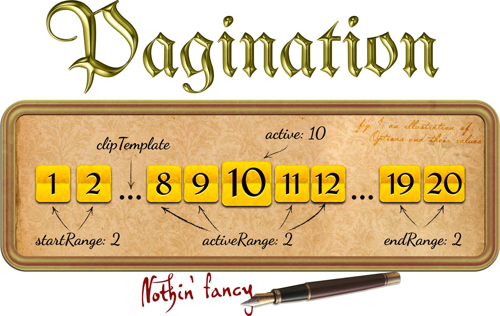

A simple, self-contained, modular controller for managing paginated links.
Perfect complement to any AJAX-powered component that displays results in sets.


Usage
-----
```js
let pager = new Pagination(el, {
	
	/** Zero-based index of initially-selected link */
	active: 2,
	
	/** Callback triggered when a link is pressed by user */
	onChange: function(newIndex, oldIndex){
		console.log(`Current page is now ${newIndex}`);
	},
	
	linkTemplate: '<li><a href="#">Custom element, you say?</a></li>'
});

/** Programmatically set selected link */
pager.active = 10;
```

Full option documentation will be written up in the near future.


License
-------
Oh, I am *so* not fussed. This is released under the [ISC license](LICENSE.md),
which is basically just a simplified version of the MIT license.

Author attribution is nice, but I won't sledge your car door in for not putting
my name in your work. Really. Credit me, thank me, send me a fruit basket, set
my face as your desktop ([I recommend this](http://i.imgur.com/vpk7mWJ.jpg))
... all are nice, but none are mandatory.
